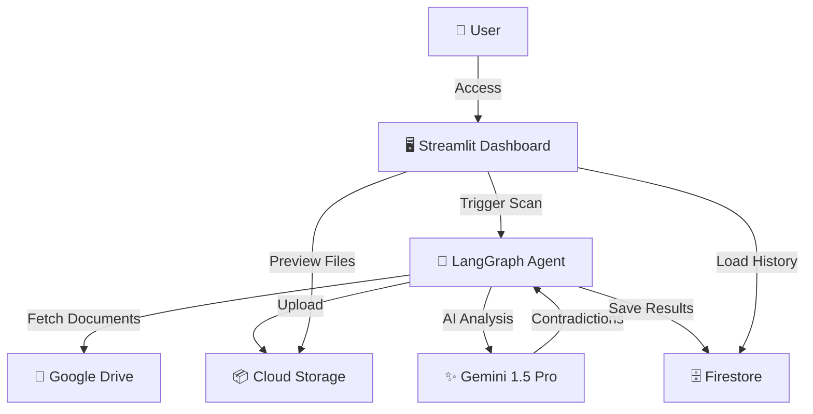

# 🛡️ DocuAlign AI


> ドキュメントの矛盾・劣化を自動検知し、常に最新・正確な状態に保つ自律型管理エージェント

**第4回 Agentic AI Hackathon with Google Cloud 出展作品**

---

## 📺 Demo


> *Admin Dashboard: AI検出問題の一覧とワンクリック承認/却下*

[📹 デモ動画を見る (2分)](./docs/demo_video.md) | [🏗️ Architecture Details](./docs/architecture.md)

---

## 🎯 プロジェクト概要

### 解決する課題

企業のマニュアル・手順書は、**システム更新のたびに内容が陳腐化**します。
しかし、数百ページに及ぶドキュメント群から矛盾箇所を人手で探すのは非現実的です。

**具体例**:
- 新バージョンで「歯車アイコン」が「サイドメニュー」に変更 → 旧マニュアルは誤手順のまま
- スクリーンショットが v2.0 の青テーマ → 実際は v3.0 のダークテーマ
- API エンドポイントが変更 → 開発者向けドキュメントが古い URL を参照

### ソリューション

DocuAlign AI は、ドキュメント更新をトリガーに **自律的に** 古い資料との矛盾を検出し、修正提案まで行う **Agentic AI** です。

### コア機能

| 機能 | 説明 | 技術 |
|---|---|---|
| ✂️ **Semantic Pruning** | 新旧ドキュメントの意味的矛盾を検出・剪定 | Gemini 1.5 Pro (2M Context) |
| 🖼️ **Visual Freshness** | マニュアル内スクリーンショットの鮮度をチェック | Gemini Multimodal |
| 🤖 **Agentic Workflow** | LangGraph による自律的な修正提案パイプライン | LangGraph + Vertex AI |
| ✅ **Human-in-the-Loop** | 管理者による承認/却下ワークフロー | St Streamlit Dashboard |

---

## 🏗️ Architecture



詳細なアーキテクチャ図は [docs/architecture.md](./docs/architecture.md) を参照してください。

---

## 🛠️ 技術スタック

| レイヤー | 技術 |
|---|---|
| **フロントエンド** | Streamlit |
| **Agent Logic** | LangGraph (Python) |
| **AI Model** | Vertex AI Gemini 1.5 Pro |
| **Search / RAG** | Vertex AI Agent Builder |
| **イベント駆動** | Eventarc + GCS |
| **データストア** | Cloud Firestore |
| **シークレット管理** | Secret Manager |
| **API連携** | Google Drive API, Google Docs API |
| **実行環境** | Google Cloud Run |
| **言語** | Python 3.11 |

---

## 🚀 Quick Start

### Prerequisites

開始前に以下を準備してください:

- [x] Google Cloud Project with billing enabled
- [x] Python 3.11+ (local development)
- [x] Docker (optional, for local container testing)
- [x] `gcloud` CLI installed and authenticated

### Step 1: Clone Repository

```bash
git clone https://github.com/Koki0812/docugardener-agent.git
cd docugardener-agent
```

### Step 2: Enable Required APIs

```bash
# Set your project ID
export PROJECT_ID="your-project-id"
gcloud config set project $PROJECT_ID

# Enable required APIs
gcloud services enable \
  run.googleapis.com \
  aiplatform.googleapis.com \
  firestore.googleapis.com \
  storage.googleapis.com \
  secretmanager.googleapis.com \
  drive.googleapis.com
```

### Step 3: Configure Environment

```bash
# Copy environment template
cp .env.example .env

# Edit .env with your configuration
nano .env
```

必須の環境変数:
- `GCP_PROJECT_ID`: Your Google Cloud project ID
- `GCP_LOCATION`: Region (default: `asia-northeast1`)
- `GCS_BUCKET`: GCS bucket name for document storage

### Step 4: Install Dependencies (Local Development)

```bash
# Create virtual environment
python3.11 -m venv venv
source venv/bin/activate  # On Windows: venv\Scripts\activate

# Install dependencies
pip install -r requirements.txt
```

### Step 5: Run Locally

```bash
streamlit run app.py
```

アプリケーションが `http://localhost:8501` で起動します。

---

## ☁️ Cloud Deployment

### Option 1: Automated Deployment (推奨)

```bash
# Linux/Mac
bash deploy.sh YOUR_PROJECT_ID asia-northeast1

# Windows PowerShell
.\deploy.ps1 -ProjectId "YOUR_PROJECT_ID" -Region "asia-northeast1"
```

### Option 2: Manual Deployment

```bash
# Build container
gcloud builds submit --tag gcr.io/$PROJECT_ID/docugardener

# Deploy to Cloud Run
gcloud run deploy docugardener \
  --image gcr.io/$PROJECT_ID/docugardener \
  --platform managed \
  --region asia-northeast1 \
  --allow-unauthenticated \
  --set-env-vars GCP_PROJECT_ID=$PROJECT_ID
```

### Production Configuration

本番環境では Secret Manager の使用を推奨します:

```bash
# Set production mode
gcloud run services update docugardener \
  --set-env-vars ENV=production \
  --region asia-northeast1
```

詳細は [docs/secret_manager_setup.md](./docs/secret_manager_setup.md) を参照してください。

---

## 📁 Project Structure

```
├── app.py                  # Streamlit ダッシュボード (マルチビュー)
├── webhook.py              # Eventarc Webhook (Flask)
├── entrypoint.sh           # Streamlit + Webhook 起動
├── Dockerfile              # Cloud Run コンテナ
├── requirements.txt        # 依存パッケージ
├── .env.example            # 環境変数テンプレート
├── config/
│   └── settings.py         # 環境変数 + Secret Manager 設定
├── services/
│   ├── drive_service.py    # Google Drive API
│   ├── docs_service.py     # Google Docs API
│   ├── vertex_ai_service.py# Gemini (テキスト + マルチモーダル)
│   ├── search_service.py   # Agent Builder 検索
│   └── firestore_service.py# Cloud Firestore
├── views/
│   ├── admin_view.py       # 管理者ダッシュボード
│   └── user_view.py        # エンドユーザー ドライブ
├── agent/
│   ├── state.py            # LangGraph AgentState
│   ├── nodes.py            # パイプラインノード
│   └── graph.py            # LangGraph StateGraph
└── docs/
    ├── architecture.md     # アーキテクチャ詳細
    ├── secret_manager_setup.md # Secret Manager セットアップ
    └── troubleshooting.md  # トラブルシューティング
```

---

## 🧪 Testing

```bash
# Run unit tests
pytest tests/

# Run with coverage
pytest --cov=. --cov-report=html
```

---

## 📖 Documentation

- [🏗️ Architecture Details](./docs/architecture.md)
- [🔐 Secret Manager Setup](./docs/secret_manager_setup.md)
- [🐛 Troubleshooting Guide](./docs/troubleshooting.md)
- [🚀 Deployment Guide](./docs/deployment_procedure.md)

---

## 🤝 Contributing

Contributions are welcome! Please feel free to submit a Pull Request.

---

## 📄 License

MIT License - see [LICENSE](./LICENSE) for details

---

## 👥 Team

**第4回 Agentic AI Hackathon with Google Cloud**

- Developer: [@Koki0812](https://github.com/Koki0812)

---

## 🙏 Acknowledgments

- Google Cloud Platform for Vertex AI and Cloud Run
- LangChain team for LangGraph framework
- Streamlit team for the amazing dashboard framework
