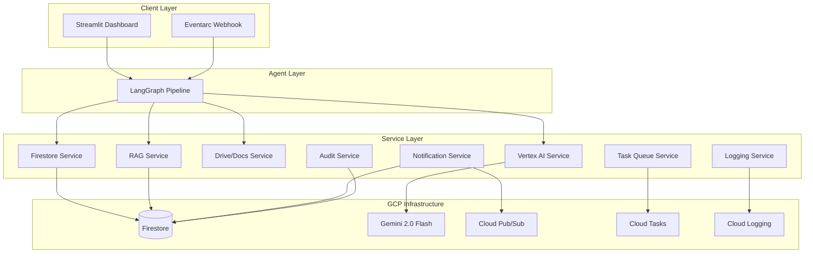
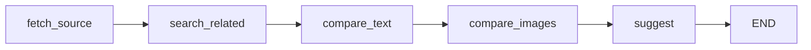

# DocuAlign AI — API Reference

> Internal API documentation for the DocuAlign AI document management agent.

---

## Architecture Overview



---

## Services API

### Vertex AI Service (`services/vertex_ai_service.py`)

#### `compare_text(new_doc_text, old_doc_text, feedback_context="")`

Detects semantic contradictions between two documents using Gemini 2.0 Flash.

| Parameter | Type | Required | Description |
|-----------|------|----------|-------------|
| `new_doc_text` | `str` | ✅ | Text of the newer document |
| `old_doc_text` | `str` | ✅ | Text of the older document |
| `feedback_context` | `str` | ❌ | RAG context from past reviews |

**Returns**: `dict` with `contradictions` (list) and `summary` (str)

**Generation Config**: Native JSON output via `response_mime_type="application/json"`, temperature=0.1

---

#### `compare_images(old_image_bytes, new_image_bytes)`

Multimodal image comparison for visual decay detection.

| Parameter | Type | Required | Description |
|-----------|------|----------|-------------|
| `old_image_bytes` | `bytes` | ✅ | Old screenshot from manual |
| `new_image_bytes` | `bytes` | ✅ | Current UI screenshot |

**Returns**: `dict` with `visual_decay` (str) and `summary` (str)

---

### Firestore Service (`services/firestore_service.py`)

#### `save_scan_result(result)` → `str | None`
Save scan result. Returns document ID.

#### `get_latest_results(limit=10)` → `list[dict]`
Retrieve recent scan results (newest first).

#### `get_scan_result(scan_id)` → `dict | None`
Get specific scan by ID.

#### `delete_scan_result(scan_id)` → `bool`
Delete a scan result.

#### `save_review_feedback(feedback)` → `str | None`
Save reviewer decision for AI learning loop.

#### `get_recent_feedback(limit=20)` → `list[dict]`
Retrieve recent feedback for prompt enrichment.

---

### RAG Service (`services/rag_service.py`)

#### `save_review_feedback(scan_id, issue_key, decision, ...)`
Store reviewer decision with denormalized fields for efficient querying.

#### `get_feedback_context(category="", limit=10)` → `str`
Build formatted context string for Gemini prompt enrichment. Separates approved (valid issues) from denied (false positives).

#### `get_feedback_stats()` → `dict`
Summary statistics: total, approved, denied counts, accuracy rate, top categories.

---

### Audit Service (`services/audit_service.py`)

#### `log_audit_event(action, user, resource_type, resource_id, details, result)`
Generic audit event logging to Firestore.

#### `audit_review_action(scan_id, issue_key, decision, reviewer, reason)`
Log review approve/deny decision.

#### `audit_scan_execution(scan_id, doc_count, trigger, user)`
Log scan execution event.

#### `audit_config_change(setting_name, old_value, new_value, user)`
Log configuration change.

#### `get_audit_trail(resource_type="", resource_id="", limit=50)` → `list[dict]`
Query audit trail with optional filtering.

---

### Notification Service (`services/notification_service.py`)

#### `notify_scan_complete(scan_id, total_issues, critical_count, doc_count)`
Send scan completion notification via Pub/Sub (critical issues go to alert topic).

#### `notify_critical_issue(scan_id, issue_category, issue_message, doc_name)`
Send immediate critical issue alert.

#### `get_unread_notifications(limit=20)` → `list[dict]`
Get unread in-app notifications (Firestore-backed).

#### `mark_notification_read(notification_id)` → `bool`
Mark notification as read.

---

### Task Queue Service (`services/task_queue_service.py`)

#### `enqueue_scan(doc_ids, trigger, priority, delay_seconds)` → `str | None`
Enqueue single scan job to Cloud Tasks.

#### `enqueue_batch_scan(doc_ids, batch_size=5, delay_between=2)` → `list[str]`
Enqueue multiple batches with rate limiting.

#### `get_queue_stats()` → `dict`
Queue statistics for dashboard monitoring.

---

### Logging Service (`services/logging_service.py`)

#### `setup_logging()`
Initialize logging (Cloud Logging in production, colored local in dev).

#### `log_scan_event(event_type, metadata=None)`
Structured JSON event log.

#### `log_api_call(service, method, duration_ms, success, error="")`
API call timing metrics.

#### `log_issue_detected(scan_id, category, severity, message)`
Issue detection event.

#### `log_review_action(scan_id, issue_key, action, reviewer)`
Review decision event.

---

## Agent Pipeline (`agent/`)

### LangGraph Nodes



| Node | Description | Service Dependencies |
|------|-------------|---------------------|
| `fetch_source` | Fetch document from Google Drive/Docs | `drive_service`, `docs_service` |
| `search_related` | Find related old docs via Agent Builder | `search_service` |
| `compare_text` | Gemini text contradiction detection | `vertex_ai_service`, `rag_service` |
| `compare_images` | Gemini multimodal visual decay detection | `vertex_ai_service` |
| `suggest` | Generate fix suggestions | `vertex_ai_service`, `docs_service` |

---

## Webhook Endpoint (`webhook.py`)

### `POST /webhook/scan`

Triggered by Eventarc when files are uploaded to GCS.

**Request Body**:
```json
{
  "bucket": "hackathon4-487208-docs",
  "name": "documents/guide_v2.docx",
  "contentType": "application/pdf"
}
```

**Response**: `200 OK` with scan result summary

---

## Configuration (`config/settings.py`)

### Environment Variables

| Variable | Default | Description |
|----------|---------|-------------|
| `GCP_PROJECT_ID` | — | Google Cloud project ID |
| `GCP_LOCATION` | `asia-northeast1` | GCP region |
| `GEMINI_MODEL` | `gemini-2.0-flash` | Gemini model name |
| `GCS_BUCKET` | `hackathon4-487208-docs` | GCS bucket for documents |
| `FIRESTORE_COLLECTION` | `scan_results` | Firestore collection name |
| `ENV` | `development` | Environment (`production` / `development`) |
| `LOG_LEVEL` | `INFO` | Logging level |

### Secret Manager Integration

Production secrets are loaded via `get_secret(secret_id, default)`:
- `search-engine-id` — Vertex AI Agent Builder
- `search-data-store-id` — Discovery Engine data store
- `drive-folder-id` — Google Drive folder

---

## Error Handling

### Retry Mechanism (`utils/retry.py`)

```python
@retry_with_backoff(max_retries=3, base_delay=2.0)
def call_gemini_api(prompt):
    return model.generate_content(prompt)
```

### Circuit Breaker

Pre-configured breakers for external services:
- `gemini_breaker` — 5 failures, 60s recovery
- `firestore_breaker` — 5 failures, 30s recovery
- `drive_breaker` — 3 failures, 45s recovery
