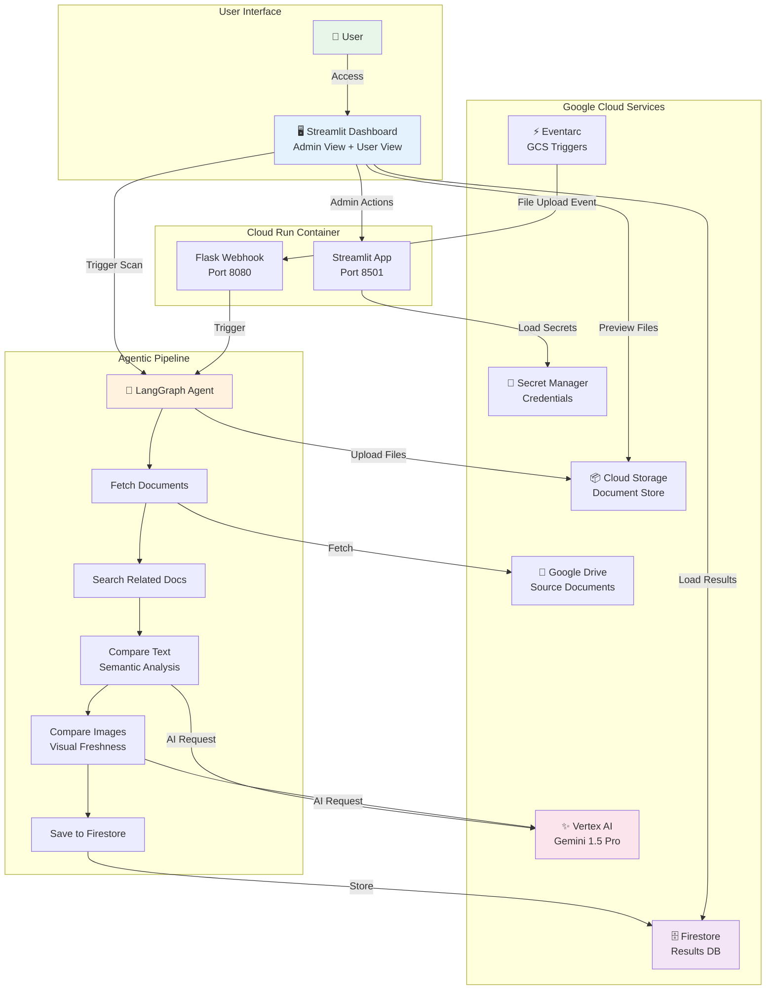
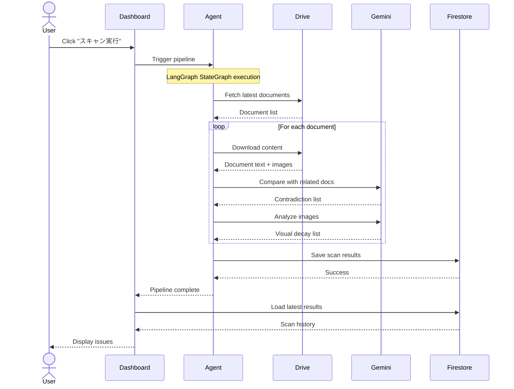
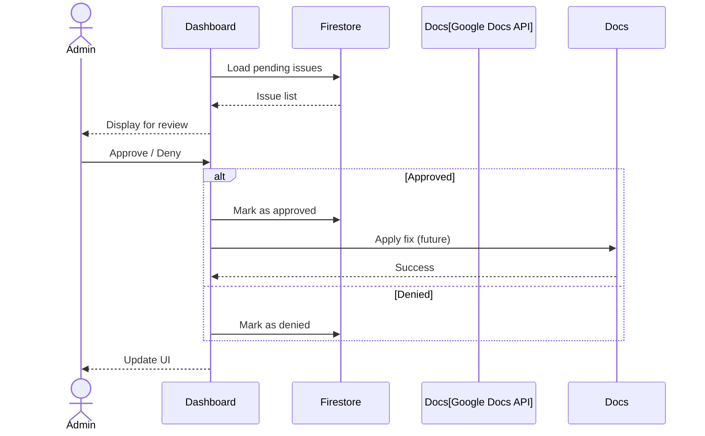
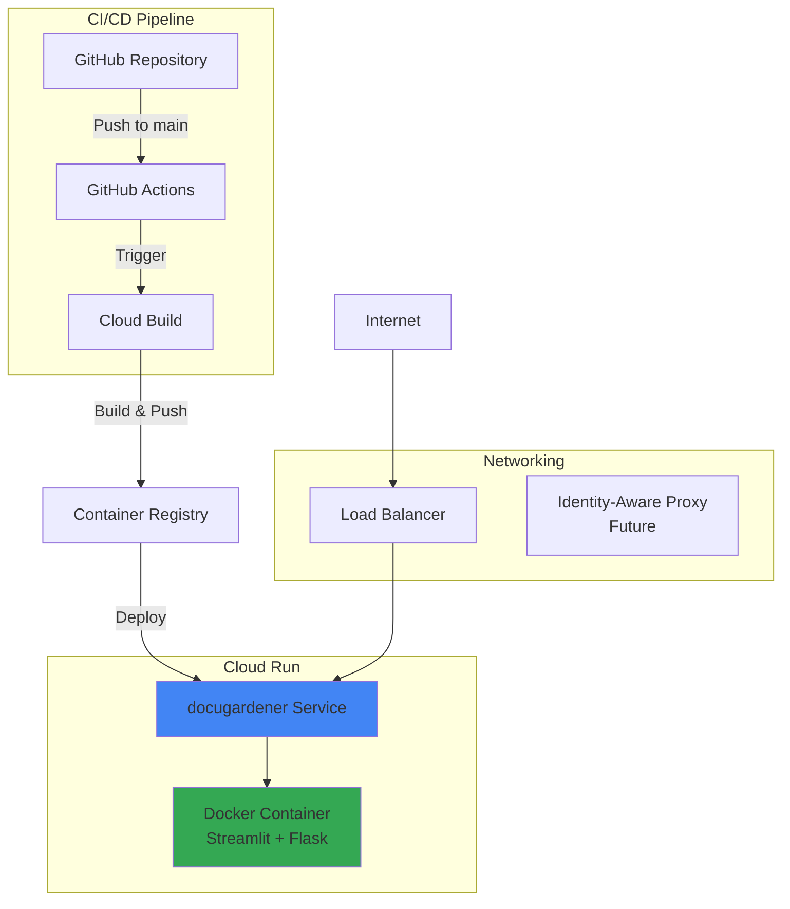
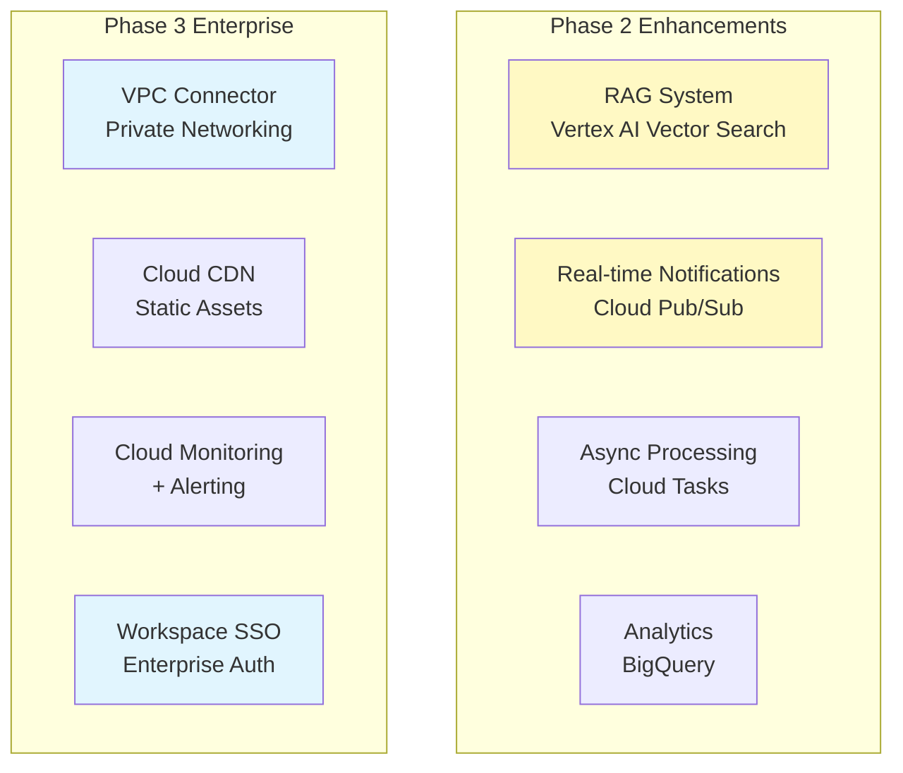
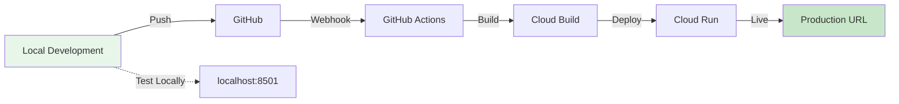

# DocuAlign AI - Architecture Documentation

> 詳細なシステムアーキテクチャと技術設計

---

## 📐 System Architecture Overview



---

## 🔄 Data Flow Sequence

### 1. Document Scan Workflow



### 2. Human-in-the-Loop Approval



---

## 🧩 Component Architecture

### LangGraph Pipeline Nodes

```mermaid
graph LR
    Start((Start)) --> Init[Initialize State]
    Init --> Fetch[fetch_source_docs]
    Fetch --> Search[search_related_docs]
    Search --> CompareText[compare_text_node]
    CompareText --> CompareImg[compare_images_node]
    CompareImg --> Save[save_results_node]
    Save --> End((End))
    
    style Start fill:#4CAF50
    style End fill:#F44336
    style CompareText fill:#FF9800
    style CompareImg fill:#FF9800
```



**Node Descriptions**:

| Node | Purpose | AI Integration |
|------|---------|----------------|
| `fetch_source_docs` | Google Drive から最新ドキュメントを取得 | - |
| `search_related_docs` | 関連する旧バージョンを検索 | Vertex AI Agent Builder |
| `compare_text_node` | テキストの意味的矛盾を検出 | Gemini 1.5 Pro (2M Context) |
| `compare_images_node` | スクリーンショットの鮮度をチェック | Gemini Multimodal (Vision) |
| `save_results_node` | 結果を Firestore に保存 | - |

---

## 🗄️ Data Model

### Firestore Schema

```
scan_results (Collection)
├── {scan_id} (Document)
│   ├── scan_id: string
│   ├── file_name: string
│   ├── triggered_at: timestamp
│   ├── status: "completed" | "failed"
│   ├── contradictions: array<Contradiction>
│   │   ├── category: string
│   │   ├── severity: "critical" | "warning" | "info"
│   │   ├── old_text: string
│   │   ├── new_text: string
│   │   ├── message: string
│   │   ├── suggestion: string
│   │   └── old_doc: string
│   ├── visual_decays: array<VisualDecay>
│   │   ├── category: string
│   │   ├── severity: "critical" | "warning"
│   │   ├── description: string
│   │   ├── suggestion: string
│   │   └── type: "screenshot_outdated" | "ui_change"
│   └── related_docs: array<string>
```

### Session State (Streamlit)

```python
st.session_state = {
    "agent_logs": [],
    "agent_results": dict,
    "scan_history": list[dict],
    "review_status": {
        "{scan_id}_issue_{index}": "approved" | "denied" | "pending"
    },
    "review_reasons": {
        "{scan_id}_issue_{index}": string
    }
}
```

---

## 🔐 Security Architecture

```mermaid
graph TB
    subgraph "Secrets Management"
        EnvLocal[.env File<br/>Local Dev]
        SecretMgr[Secret Manager<br/>Production]
    end
    
    subgraph "Application"
        Settings[config/settings.py<br/>get_secret()]
    end
    
    subgraph "Services"
        Drive[Drive Service]
        Vertex[Vertex AI Service]
        Firestore[Firestore Service]
    end
    
    EnvLocal -.->|ENV != production| Settings
    SecretMgr -->|ENV == production| Settings
    Settings --> Drive
    Settings --> Vertex
    Settings --> Firestore
    
    style SecretMgr fill:#4CAF50
    style EnvLocal fill:#FF9800
```

**Security Best Practices**:
- ✅ Secret Manager for production credentials
- ✅ Environment variable fallback for local development
- ✅ No secrets in source code or Docker images
- ✅ IAM roles for service-to-service authentication
- ⬜ (Future) VPC connector for private networking

---

## 🚀 Deployment Architecture



**Deployment Configuration**:
- **Platform**: Cloud Run (fully managed)
- **Region**: `asia-northeast1`
- **Scaling**: 0 to 10 instances (auto-scaling)
- **Memory**: 2GB
- **CPU**: 2 vCPU
- **Concurrency**: 80 requests per instance
- **Timeout**: 300 seconds

---

## 📊 Infrastructure Costs (Estimated)

| Service | Usage | Estimated Monthly Cost |
|---------|-------|------------------------|
| Cloud Run | ~1000 requests/month | $0.50 |
| Firestore | ~10K reads, 1K writes | $0.20 |
| Cloud Storage | 10GB, 100 operations | $0.30 |
| Vertex AI (Gemini) | ~100K tokens/month | $5.00 |
| Secret Manager | 3 secrets, 100 accesses | $0.10 |
| **Total** | | **~$6.10/month** |

> **Note**: Costs may vary based on actual usage. Hackathon projects within free tier limits may incur $0 cost.

---

## 🔮 Future Architecture Enhancements



**Planned Features**:
1. **RAG Integration**: Learn from past approvals/denials
2. **Real-time Notifications**: Slack/Email alerts on new issues
3. **Batch Processing**: Cloud Tasks for large document sets
4. **Advanced Analytics**: BigQuery for trend analysis
5. **Enterprise SSO**: Google Workspace integration

---

## 📚 Technology Stack Details

### Backend
- **Language**: Python 3.11
- **Agent Framework**: LangGraph 0.0.40+
- **AI SDK**: LangChain-Google-VertexAI 0.0.6+

### Frontend
- **Framework**: Streamlit 1.31.0+
- **Styling**: Custom CSS (Apple-inspired design)

### Infrastructure
- **Container**: Docker (multi-stage build)
- **Runtime**: Cloud Run (Python 3.11-slim)
- **Entrypoint**: Shell script (`entrypoint.sh`) running Streamlit + Flask concurrently

### APIs & Services
- **AI**: Vertex AI Gemini 1.5 Pro
- **Storage**: Google Cloud Storage + Firestore
- **Search**: Vertex AI Agent Builder (Discovery Engine)
- **Auth**: Google Drive API + OAuth 2.0

---

## 🛠️ Development Workflow



1. **Local Development**: `streamlit run app.py`
2. **Commit & Push**: Git push to `main` branch
3. **CI/CD**: GitHub Actions triggers Cloud Build
4. **Build**: Docker container built & pushed to GCR
5. **Deploy**: Cloud Run automatically deploys new version
6. **Live**: Service available at production URL

---

## 🔗 Related Documentation

- [Secret Manager Setup](./secret_manager_setup.md)
- [Deployment Procedure](./deployment_procedure.md)
- [Troubleshooting Guide](./troubleshooting.md)
