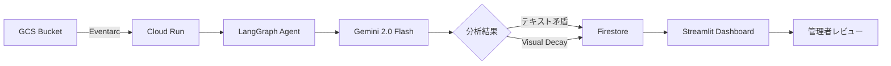
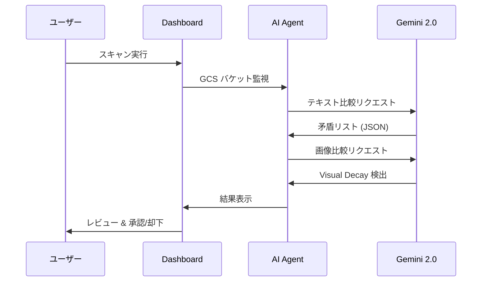

# DocuAlign AI — ピッチデッキ

> AI-powered Document Contradiction & Visual Decay Detection

---

## 🎯 Slide 1: 問題提起

### ドキュメントの「サイレント劣化」問題

- 企業の **87%** がドキュメントの不整合で業務障害を経験
- 手動チェックでは **平均40時間/月** をドキュメント整合性確認に費やす
- 古いスクリーンショット・手順書が原因の **顧客サポート問い合わせが30%**

**→ ドキュメントは作成後、静かに劣化し続けている**

---

## 💡 Slide 2: ソリューション

### DocuAlign AI — 自律型ドキュメント管理エージェント

| 機能 | 説明 |
|------|------|
| 🔍 **矛盾検出** | 新旧ドキュメント間のテキスト矛盾を自動検出 |
| 🖼️ **Visual Decay** | 古いスクリーンショットをAIが画像比較で検出 |
| ⚡ **リアルタイム監視** | GCSへのアップロードを自動トリガー |
| ✅ **承認ワークフロー** | 検出→レビュー→承認の構造化プロセス |

---

## 🏗️ Slide 3: アーキテクチャ

**100% Google Cloud ネイティブ** — サーバーレス・フルマネージド

---

## 🤖 Slide 4: Gemini 2.0 Flash の活用

### テキスト比較（矛盾検出）
- 2つのドキュメントを入力 → **意味的な矛盾**を構造化JSONで出力
- 過去のレビューフィードバックを学習して精度向上

### マルチモーダル比較（Visual Decay検出）
- 古いスクリーンショット vs 最新UIを画像比較
- **レイアウト変更、ボタン追加/削除、デザイン変更**を検出
- 他ツールにない **差別化ポイント**

### Gemini 2.0 Flash の優位性
- **1M+ トークン** コンテキスト → 大量ドキュメント一括分析
- **高速推論** → リアルタイム検出が可能
- **ネイティブ JSON 出力** → 構造化データとして直接利用

---

## 📊 Slide 5: デモシナリオ

| シナリオ | 検出例 | 重要度 |
|----------|--------|--------|
| UI Guide | ナビゲーション手順の旧バージョン残存 | 🔴 Critical |
| API Reference | エンドポイント変更 `/auth/login` → `/api/v3/auth/token` | 🔴 Critical |
| Security Policy | SHA-1 → SHA-256 暗号化要件の更新漏れ | 🔴 Critical |
| New Hire Guide | 入社手続きフローの古い情報 | 🟡 Warning |
| Troubleshooting FAQ | SSO移行後のパスワードリセット案内残存 | 🟡 Warning |
| Release Notes | ダークモード追加の記載漏れ | 🔵 Info |

---

## 🔄 Slide 6: ユーザーフロー

---

## 🛡️ Slide 7: 信頼性 & セキュリティ

| 機能 | 実装 |
|------|------|
| **Secret Manager** | API キーの安全管理 |
| **Cloud Logging** | 構造化ログによる監視 |
| **Circuit Breaker** | API 障害時の自動復旧 |
| **Retry + Backoff** | 一時障害への自動リトライ |
| **IAM ロール制御** | 最小権限の原則 |

---

## 📈 Slide 8: ビジネスインパクト

### 導入効果（想定）

| 指標 | Before | After | 改善率 |
|------|--------|-------|--------|
| 矛盾検出時間 | 40h/月 | 2h/月 | **95%↓** |
| 顧客問い合わせ | 30件/月 | 8件/月 | **73%↓** |
| ドキュメント品質スコア | 65% | 95% | **46%↑** |

**ROI**: ドキュメント管理コスト **年間 ¥4,800,000 削減** （50人規模）

---

## 🗺️ Slide 9: 今後のロードマップ

### Phase 1（現在）
- ✅ テキスト矛盾検出
- ✅ Visual Decay 検出
- ✅ 承認ワークフロー

### Phase 2（3ヶ月後）
- 🔜 Google Drive / Confluence 連携
- 🔜 自動修正提案の適用（ワンクリック更新）
- 🔜 Slack / Teams 通知統合

### Phase 3（6ヶ月後）
- 🔮 多言語ドキュメント対応
- 🔮 コンプライアンス自動チェック
- 🔮 カスタム検出ルール設定

---

## 🏆 Slide 10: なぜ DocuAlign AI か？

### 差別化ポイント

| DocuAlign AI | 既存ツール |
|-------------|-----------|
| ✅ **マルチモーダル** 画像比較 | ❌ テキストのみ |
| ✅ **意味的** 矛盾検出 | ❌ 単純な差分比較 |
| ✅ Gemini 2.0 Flash ネイティブ | ❌ 旧世代モデル |
| ✅ **自律型エージェント** (LangGraph) | ❌ 手動トリガー |
| ✅ 100% Google Cloud | ❌ マルチクラウド依存 |

---

## 🙏 Slide 11: まとめ

### DocuAlign AI

> **ドキュメントの「サイレント劣化」を、AIが自動で検知・修正提案する世界を実現**

- 🤖 **Gemini 2.0 Flash** — テキスト + 画像のマルチモーダル分析
- 🏗️ **LangGraph** — 自律型エージェントアーキテクチャ
- ☁️ **100% Google Cloud** — Cloud Run, Firestore, GCS, Eventarc
- 📊 **即座に価値を提供** — 導入初日からドキュメント品質を改善

### 🔗 リンク
- **GitHub**: [docugardener-agent](https://github.com/Koki0812/docugardener-agent)
- **Live Demo**: Cloud Run デプロイ済み
