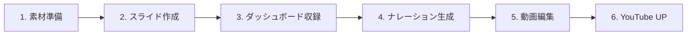
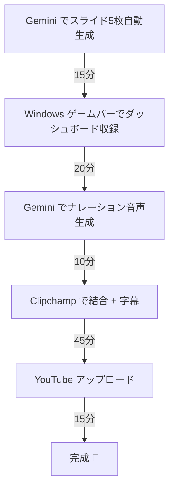

# デモ動画 制作ガイド（0 → YouTube アップロードまで）

> **所要時間目安**: 3〜5時間（素材作成 2h + 収録 1h + 編集 1h + アップロード 0.5h）
> **完成動画**: 3分30秒以内 / 1920×1080 / 16:9

---

## 📋 全体フロー



---

## Step 1: 素材準備（30分）

### 1-1. ロゴ・アイコン画像

既に `assets/icon.png` があればそれを使用。なければ Gemini で生成：

```
🤖 Geminiプロンプト（Google AI Ultra → gemini.google.com）:

「DocuAlign AIのロゴを生成してください。
シンプルでモダンなデザイン。ドキュメント📄とAI🤖の融合。
色: 紺＋緑グラデーション。背景透過。512×512px」
```

### 1-2. アーキテクチャ図（生成済み✅）

以下の2つのアーキテクチャ図が `docs/` に生成済みです：

| ファイル | 内容 |
|---------|------|
| `docs/architecture_runtime.png` | ランタイムアーキテクチャ（GCPサービス全体構成） |
| `docs/architecture_development.png` | 開発アーキテクチャ（Google AntiGravity + CI/CD） |

再生成する場合：
```powershell
$env:PATH = "C:\Program Files\Graphviz\bin;" + $env:PATH
python scripts/generate_architecture.py
```

### 1-3. BGM（任意）

- [YouTube Audio Library](https://studio.youtube.com/channel/UC/music)（無料・著作権フリー）
- キーワード: `corporate`, `technology`, `upbeat` で検索
- 音量は小さめ（ナレーションの邪魔にならない程度）

---

## Step 2: スライド作成 🤖AI活用（45分）

### 方法A: Gemini でスライド原案を自動生成（推奨）

```
🤖 Geminiプロンプト（Google AI Ultra）:

以下の台本に基づいて、Google Slidesのスライドを7枚作成してください。

スライド1: タイトル「DocuAlign AI」— サブタイトル「AI-Powered Document Integrity Agent」
スライド2: 問題提起 — 「サイレント劣化」の統計データ（3つの数字を大きく表示）
スライド3: ランタイムアーキテクチャ図（architecture_runtime.png を使用）
スライド4: 開発アーキテクチャ — Google AntiGravity（architecture_development.png を使用）
スライド5: コア技術パイプライン（取得→検索→分析→画像→提案）
スライド6: ビジネス価値（ROI: 95%削減、73%減少、480万円/年）
スライド7: クロージング（GitHub URL + 「ありがとうございました」）

デザイン: ダークテーマ、紺×緑グラデーション、モダンでプロフェッショナル
```

> [!TIP]
> Google AI Ultra では Gemini が直接 Google Slides を作成可能です。
> 「Google Slides で作成して」と追加すると、ドライブに直接保存されます。

### 方法B: 手動で Google Slides 作成

1. [Google Slides](https://slides.google.com/) → 新規作成
2. テーマ: `シフト` や `モメンタム`（ダーク系）
3. 以下の5枚を作成：

| # | 内容 | 表示時間 |
|---|------|---------|
| 1 | タイトルカード + ロゴ | 0:00-0:15 |
| 2 | 問題提起（数字3つ） | 0:15-0:40 |
| 3 | ランタイムアーキテクチャ図 | 1:30-2:10 |
| 4 | 開発アーキテクチャ / Google AntiGravity | 2:10-2:40 |
| 5 | コア技術パイプライン | （補足用） |
| 6 | ROI・ビジネス価値 | 2:40-3:10 |
| 7 | クロージング + GitHub URL | 3:10-3:30 |

---

## Step 3: ダッシュボード画面収録（30分）

### 3-1. 事前準備

```powershell
# ローカルでStreamlitを起動
cd c:\Users\de3user\.gemini\antigravity\scratch\streamlit-cloud-run-template
python -m streamlit run app.py
```

> [!IMPORTANT]
> Cloud Run にデプロイ済みの場合は、デプロイ URL を使って収録する方がよりリアルです。

### 3-2. 収録ツールの選択

| ツール | 特徴 | 推奨度 |
|--------|------|--------|
| **OBS Studio** | 無料・高品質・カスタマイズ自在 | ⭐⭐⭐ |
| **PowerPoint 録画** | PPT内蔵の画面収録 | ⭐⭐ |
| **Windowsゲームバー** | Win+G で即座に収録 | ⭐⭐ |
| **Loom** | 簡単・共有しやすい | ⭐⭐ |

### 3-3. OBS Studio での収録手順

1. [OBS Studio をインストール](https://obsproject.com/ja/download)
2. 設定:
   - **出力** → 録画品質: `高品質、ファイルサイズ中` / フォーマット: `mp4`
   - **映像** → 基本解像度: `1920x1080` / 出力解像度: `1920x1080` / FPS: `30`
3. ソース追加:
   - `ウィンドウキャプチャ` → ブラウザ（Streamlit画面）を選択
4. **録画開始**（赤丸ボタン）
5. 台本に沿ってダッシュボードを操作:
   - サイドバー「🚀 スキャン実行」クリック
   - 結果カードをゆっくりスクロール
   - 「✅ 承認」ボタンをクリック
6. **録画停止**

### 3-4. 簡易収録（Windows ゲームバー）

```
1. ブラウザで Streamlit を全画面表示
2. Win + G → 「キャプチャ」ウィンドウの ● ボタンで録画開始
3. 台本に沿って操作
4. Win + G → ■ で録画停止
5. 保存先: C:\Users\de3user\Videos\Captures\
```

---

## Step 4: ナレーション生成 🤖AI活用（30分）

### 方法A: NotebookLM Audio Overview（最も簡単）

1. [NotebookLM](https://notebooklm.google.com/) を開く
2. 新しいノートブックを作成
3. `docs/demo_video_script.md` の台本テキストをソースとしてアップロード
4. **「Audio Overview」** をクリック
5. 生成された音声をダウンロード

> [!WARNING]
> NotebookLM の Audio Overview は対話形式になるため、
> そのまま使えない場合があります。その場合は方法B を使用してください。

### 方法B: Gemini で音声生成（推奨）

```
🤖 Geminiプロンプト（Google AI Ultra → gemini.google.com）:

以下のナレーション原稿を、落ち着いた日本語男性の声で読み上げた音声を生成してください。
速度はやや遅め、プレゼンテーション向けのトーンでお願いします。

---
（台本のナレーション部分をここにコピペ）
---
```

> [!TIP]
> Google AI Ultra プランでは、Gemini が直接音声ファイル（.wav/.mp3）を
> 生成できます。品質が高くおすすめです。

### 方法C: 自分で読み上げ

1. マイクを用意（PC内蔵マイク or ヘッドセット）
2. 静かな環境で収録
3. 台本を見ながらゆっくり読む（1文ごとに少し間を空ける）
4. ツール: **Windows ボイスレコーダー** or **Audacity**（無料）

> [!TIP]
> 自分の声で収録後、Gemini に「この音声のノイズを除去して」と
> 依頼することもできます（AI Ultra機能）。

---

## Step 5: 動画編集 🤖AI活用（60分）

### 方法A: Google Vids（推奨・最も簡単）🤖

> Google Workspace に含まれる AI 動画エディタ

1. [Google Vids](https://vids.google.com/) を開く
2. 「+」→「スクリプトを使って作成」
3. 台本テキストを貼り付け → AI が自動でシーン構成を提案
4. 各シーンに素材を割り当て:
   - シーン1: タイトルスライド画像
   - シーン2: 問題提起スライド
   - シーン3-5: ダッシュボード収録動画
   - シーン6: アーキテクチャ図
   - シーン7: ROIスライド
   - シーン8: クロージングスライド
5. ナレーション音声をタイムラインにドラッグ
6. BGM を追加（組み込みライブラリから選択可能）
7. エクスポート → MP4

### 方法B: Clipchamp（Windows 11 標準）

1. スタートメニュー → 「Clipchamp」を検索して起動
2. 「新しいビデオを作成」
3. メディアをインポート:
   - スライド画像（PNG/JPG）
   - ダッシュボード収録（MP4）
   - ナレーション音声（MP3/WAV）
4. タイムラインに配置:

```
タイムライン構成:

[0:00-0:15] タイトルスライド + ナレーション①
[0:15-0:40] 問題提起スライド + ナレーション②
[0:40-1:30] ダッシュボード収録映像 + ナレーション③④⑤
[1:30-2:10] ランタイムアーキテクチャ図 + ナレーション⑥
[2:10-2:40] 開発アーキテクチャ（AntiGravity）+ ナレーション⑦
[2:40-3:10] ROIスライド + ナレーション⑧
[3:10-3:30] クロージングスライド + ナレーション⑨
```

5. トランジション追加:
   - 各シーン間に「フェード」（0.5秒）
6. BGM を追加 → 音量 15-20% に下げる
7. **エクスポート** → 1080p → MP4 保存

### 方法C: CapCut（無料・高機能）

1. [CapCut PC版](https://www.capcut.com/) をインストール
2. 素材をインポート → タイムライン配置
3. **AI 字幕生成**: 「テキスト」→「自動キャプション」→ 日本語選択
   - ナレーションから自動で字幕を生成してくれる
4. エクスポート → 1080p

---

## Step 6: YouTube アップロード（15分）

### 6-1. アップロード

1. [YouTube Studio](https://studio.youtube.com/) を開く
2. 右上の「作成」→「動画をアップロード」
3. 完成した MP4 ファイルを選択

### 6-2. メタデータ入力

```yaml
タイトル: DocuAlign AI — AI-Powered Document Integrity Agent | Google Cloud Hackathon 2026
説明文: |
  DocuAlign AI は、Gemini 2.0 Flash と LangGraph を活用して
  ドキュメントの「サイレント劣化」を自動検出する
  AI エージェントです。

  🔗 GitHub: https://github.com/Koki0812/docugardener-agent
  ☁️ Google Cloud: Cloud Run, Firestore, GCS, Eventarc
  🤖 AI: Gemini 2.0 Flash (Multimodal)
  🛠️ 開発: Google AntiGravity（AI アシスト開発）

  #GoogleCloud #Gemini #AI #Hackathon #LangGraph #AntiGravity
タグ: Google Cloud, Gemini, AI, ハッカソン, LangGraph, AntiGravity, Document Management
カテゴリ: 科学と技術
言語: 日本語
サムネイル: タイトルスライドのスクリーンショット
```

### 6-3. 公開設定

| 設定 | 推奨値 |
|------|--------|
| 公開範囲 | **公開** or **限定公開** |
| 視聴者 | 子供向けではない |
| コメント | オン |

### 6-4. Zenn 記事への埋め込み

YouTube の動画 URL から VIDEO_ID を取得して埋め込み：

```markdown
@[youtube](VIDEO_ID)

例: @[youtube](dQw4w9WgXcQ)
```

---

## ✅ 最終チェックリスト

- [ ] 動画が3分30秒以内に収まっている
- [ ] 音声が聞き取りやすい（BGMが大きすぎない）
- [ ] ダッシュボードの操作が見やすい
- [ ] ランタイムアーキテクチャ図のテキストが読める
- [ ] 開発アーキテクチャ / Google AntiGravity の説明が含まれている
- [ ] GitHub URL が画面に表示されている
- [ ] YouTube にアップロード完了
- [ ] Zenn 記事に `@[youtube](ID)` で埋め込み完了

---

## 🚀 最短ルート（AI フル活用・約2時間）



> [!TIP]
> **最短ルートのポイント**:
> 1. スライドは Gemini に Slides で作らせる（手動デザイン不要）
> 2. ナレーションは Gemini 音声生成（録音不要）
> 3. 編集は Clipchamp（インストール不要、Windows標準）
> 4. 凝りすぎない — 内容 > 映像美
