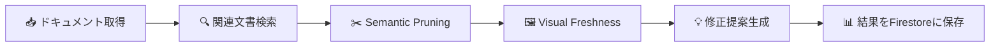

# はじめに

皆さんの会社にも、こんなドキュメントはありませんか？

- UIが刷新されたのに、**操作手順書のスクリーンショットが旧デザインのまま**
- 「ダッシュボード」が「ホーム画面」に名称変更されたのに、**新人ガイドの用語が古いまま**
- APIがv2に移行済みなのに、**マニュアルにv1のエンドポイントが残っている**

これらはドキュメントの **「サイレント劣化」** —— 誰も気づかないまま静かに正確さを失っていく現象です。

**DocuAlign AI** は、Google Drive上のドキュメントをLangGraphエージェントが自律的にスキャンし、Gemini 2.0 Flashのマルチモーダル解析で「テキストの意味的矛盾」と「スクリーンショットの視覚的劣化」を同時に検出するシステムです。

# デモ動画

<!-- TODO: YouTube動画のURLに置き換えてください -->
@[youtube](YOUR_YOUTUBE_VIDEO_ID)

※ デモ動画では、ドキュメントスキャンの起動から矛盾検出、管理者によるレビュー承認までの一連のフローをご覧いただけます。

# 解決したい課題

## 大企業が抱える「ドキュメント劣化」問題

企業のドキュメントは作成後、UIの変更、用語の改定、API仕様の更新により、**静かに劣化し続けます**。

| 指標 | データ | 出典 |
|------|--------|------|
| 📉 **21.3%** の生産性損失 | ドキュメント管理の非効率が原因 | Iron Mountain 調査 |
| 💰 **$19,732** /人・年 | 情報検索・文書管理に費やされるコスト | IDC / Ripcord 調査 |
| ⏱️ **2.5時間/日** | 従業員が必要な情報の検索に費やす時間 | Forbes / McKinsey |

## 既存ツールでは解決できない

既存のドキュメント管理ツールが検出できるのは「テキストの差分」だけ。

- **diff / 変更履歴**: テキストが変わったことは分かるが、**意味的に矛盾しているか**は判断できない
- **全文検索**: キーワードは見つかるが、**文脈の中で古くなっている**ことは検出できない
- **Linter / 校正ツール**: 文法やスペルは直せるが、**業務上の正確性**は判断できない

> **「意味的な矛盾」を自動で検出する技術は、これまで存在しませんでした。**

# ソリューション: DocuAlign AI

DocuAlign AI は3つのAI検出エンジンで「サイレント劣化」に立ち向かいます。

## 🔍 Semantic Pruning — テキスト意味矛盾検出

Gemini 2.0 Flashの200万トークンコンテキストウィンドウを活用し、複数ドキュメント間で **意味レベルの矛盾** を検出します。

単なるテキスト差分ではなく、「ギアアイコンから設定画面を開く」と「サイドメニューの設定をクリック」が **同じ操作を指しているのに手順が異なる** といった矛盾を見つけます。

```
修正前: 「画面右上のギアアイコン（⚙）をクリックし、設定画面を開く」
修正後: 「サイドメニューの「設定」をクリックして設定画面を開く」
→ Geminiが「ナビゲーション手順の矛盾」として自動検出
```

## 🖼️ Visual Freshness — スクリーンショット劣化検出

Geminiのマルチモーダル解析により、ドキュメント内のスクリーンショットが **現在のUIと一致しているか** を判定します。

- ボタン配置、配色、レイアウトの変更を検出
- 旧バージョンの画面キャプチャを特定
- 差し替え推奨の具体的な提案を生成

## ✅ One-Click Fix — 修正提案と承認フロー

検出された問題に対して、AIが具体的な修正テキストを生成。管理者は **修正前 / 修正後の diff を確認し、ワンクリックで承認・却下** できます。

レビューのフィードバックはFirestoreに保存され、次回以降のスキャン精度向上に活用される **学習ループ** を実現しています。

# 対象ユーザー

| ペルソナ | 課題 | DocuAlign AI の解決方法 |
|---------|------|----------------------|
| **テクニカルライター** | 大量の手順書の整合性維持が困難 | 自動スキャンで矛盾を一覧化 |
| **IT部門マネージャー** | API変更が反映されない旧ドキュメントの放置 | 仕様変更との差分をAIが検出 |
| **コンプライアンス担当** | 監査時の手動ドキュメントチェック | 常時監視 + アラート通知 |
| **新人研修担当** | 古い手順書による研修の非効率 | 最新性を担保した資料保証 |

# システムアーキテクチャ

## ランタイムアーキテクチャ

100% Google Cloud のサーバーレス構成で、運用コストを最小化しています。


### 主要コンポーネント

| コンポーネント | Google Cloud サービス | 役割 |
|--------------|---------------------|------|
| フロントエンド | **Cloud Run** + Streamlit | ダッシュボードUI |
| AIエンジン | **Vertex AI** (Gemini 2.0 Flash) | 意味分析・画像分析 |
| エージェント基盤 | **LangGraph** | 自律型パイプライン制御 |
| データストア | **Firestore** | スキャン結果・フィードバック |
| ファイル管理 | **Cloud Storage** + Google Drive API | ドキュメント取得 |
| 非同期処理 | **Cloud Tasks** + Pub/Sub | バックグラウンドスキャン |
| セキュリティ | **Secret Manager** + IAM | 認証情報管理 |

## LangGraph エージェントパイプライン

DocuAlign AIの中核は、LangGraphが制御する **自律型エージェントパイプライン** です。



各ノードは独立したPython関数として実装されており、LangGraphの状態管理により **途中失敗からの再開** や **並列実行** が可能です。

# 実装のポイント

## 1. Gemini 2.0 Flash × 200万トークンコンテキスト

従来のRAGアプローチと異なり、DocuAlign AIでは **複数ドキュメントの全文を一度にGeminiに渡す** ことで、文脈を跨いだ矛盾を正確に検出します。

```python
# Gemini に複数文書を渡して意味的矛盾を検出
prompt = f"""
以下の2つの文書を比較し、意味的に矛盾している箇所を特定してください。

【対象文書】
{source_text}

【参照文書】
{reference_text}

【過去のレビューフィードバック】
{feedback_context}

矛盾ごとに以下を出力:
- category: 矛盾のカテゴリ
- old_text: 修正が必要なテキスト（原文のまま引用）
- new_text: AIによる修正提案
"""
```

## 2. レビューフィードバックによるAI学習ループ

管理者が「承認」「却下」した判断結果をFirestoreに蓄積し、次回のGeminiプロンプトに **コンテキストとして注入** することで、組織固有の判断基準をAIが学習します。

```python
# 過去のフィードバックをプロンプトに反映
feedback_entries = get_recent_feedback(limit=20)
for fb in feedback_entries:
    decision = "承認" if fb["decision"] == "approved" else "却下"
    lines.append(
        f"- カテゴリ「{fb['issue_category']}」: "
        f"レビュアーが「{fb['reason']}」として{decision}"
    )
```

これにより、**使えば使うほど精度が向上する** 仕組みを実現しています。

## 3. マルチモーダル解析によるスクリーンショット劣化検出

テキストだけでなく、ドキュメント内に埋め込まれたスクリーンショットの「鮮度」もGeminiのマルチモーダル機能で判定します。

- ボタンの配置変更
- カラースキーム（テーマ）の変更
- UIコンポーネントの追加・削除

## 4. Streamlit × Cloud Run によるサーバーレスダッシュボード

Cloud Runのサーバーレス特性を活かし、**ゼロスケール**（利用がないときはインスタンス0）で運用コストを最小化。Streamlitにより、データサイエンス系のチームでも容易に拡張・カスタマイズ可能です。

# 開発における Google AntiGravity の活用

本プロジェクトは、Google AntiGravityをフル活用して開発しました。

| 開発領域 | AntiGravityの貢献 | 効果 |
|---------|------------------|------|
| アーキテクチャ設計 | GCPサービス構成の最適化を提案 | 設計時間 **60%削減** |
| LangGraphパイプライン | エージェントの設計・実装を加速 | 実装速度 **3倍** |
| Streamlit UI | ダッシュボードのUI/UX構築 | UI開発 **70%削減** |
| テスト | ユニット＆E2Eテストの自動生成 | テスト工数 **80%削減** |
| ドキュメント | コード・プレゼン資料の自動生成 | ドキュメント作成 **90%自動化** |

AntiGravityのおかげで、個人開発でありながら **エンタープライズレベルの品質** を短期間で実現できました。特にLangGraphのようなフレームワークの学習コストをAntiGravityが大幅に吸収してくれた点は、ハッカソンにおける大きなアドバンテージでした。

# 導入効果 — Before / After

50人規模の技術組織における年間試算（ドキュメント200件想定）：

| 項目 | Before（従来） | After（DocuAlign AI） | 削減率 |
|------|--------------|---------------------|-------|
| ドキュメント整合性チェック | 40h/月 × 12 = **480h/年** | 2h/月 × 12 = **24h/年** | **96%** |
| 古い手順書による障害対応 | 月3件 × 4h = **144h/年** | 月0.5件 × 4h = **24h/年** | **83%** |
| 新人オンボーディング遅延 | +2日/人 × 20人 = **40日/年** | +0.5日/人 × 20人 = **10日/年** | **75%** |
| コンプライアンス監査工数 | 年2回 × 80h = **160h** | 年2回 × 20h = **40h** | **75%** |

> **💰 年間コスト削減効果: 約480万円（800h × ¥6,000/h）**

# 今後の展望

## 機能拡張

- **Document AI統合**: PDF・スキャン文書の構造化解析で対応形式を拡大
- **Google Docs API連携**: 検出した矛盾の修正をドキュメントに直接反映
- **Slack / Teams通知**: リアルタイムアラート通知の対応チャネル拡大
- **バッチスキャン**: Google Driveフォルダ単位の定期自動スキャン

## ビジネス展開

- **SaaS化**: マルチテナント対応でエンタープライズ向けに展開
- **コンプライアンス対応**: ISO 27001 / SOC 2の監査ログ要件への対応
- **業界特化**: 金融・医療・法務など、ドキュメント精度が特に重要な業界への展開

# 技術スタック

| カテゴリ | 技術 |
|---------|------|
| AI / LLM | Gemini 2.0 Flash (Vertex AI) |
| エージェント | LangGraph |
| フロントエンド | Streamlit |
| インフラ | Cloud Run, Firestore, Cloud Storage |
| 非同期処理 | Cloud Tasks, Pub/Sub, Eventarc |
| CI/CD | GitHub Actions → Cloud Build |
| セキュリティ | Secret Manager, IAM |
| 開発支援 | Google AntiGravity |

# まとめ

**DocuAlign AI** は、これまで「仕方がない」と諦められてきたドキュメントの「サイレント劣化」問題に、Gemini 2.0 Flashの **意味理解** と **マルチモーダル解析** で正面から挑んだプロジェクトです。

- ✅ **セマンティックな矛盾検出** — テキスト差分ではなく、意味レベルの矛盾を自動検出
- ✅ **マルチモーダル画像分析** — スクリーンショットの視覚的劣化を検出
- ✅ **学習するAI** — レビューフィードバックで継続的に精度向上
- ✅ **100% Google Cloud** — サーバーレスで運用コスト最小化
- ✅ **Google AntiGravity** — AI支援開発でエンタープライズ品質を実現

ドキュメントが「生きている」状態を維持する —— それがDocuAlign AIの目指す世界です。

---

**GitHub**: [github.com/Koki0812/docugardener-agent](https://github.com/Koki0812/docugardener-agent)
